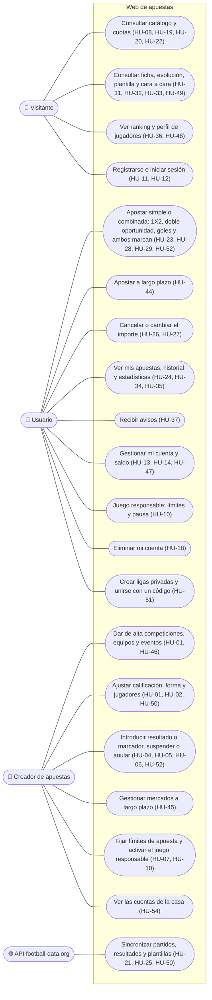
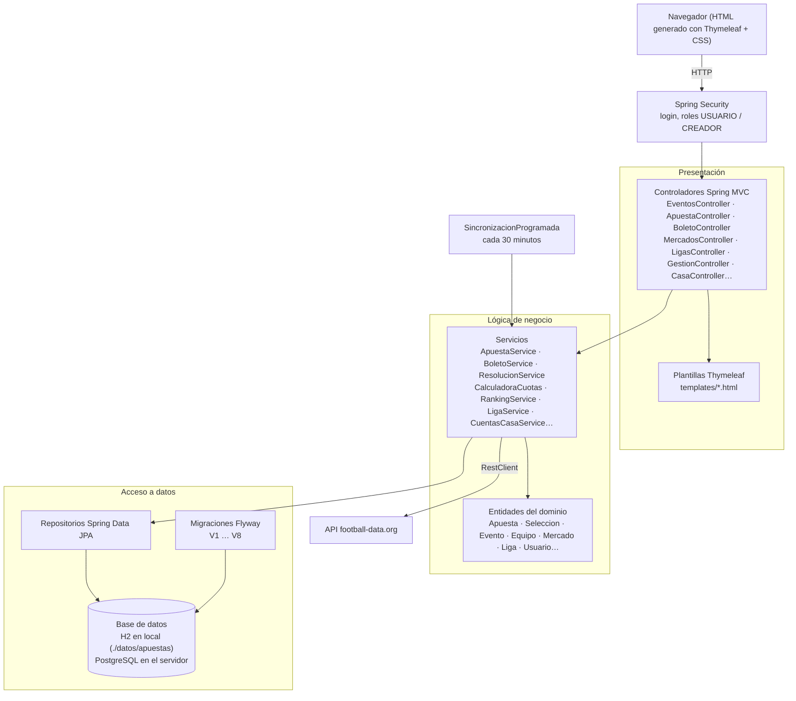
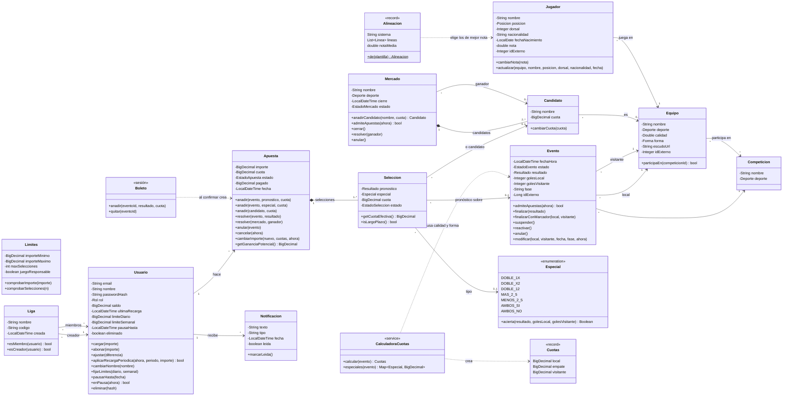
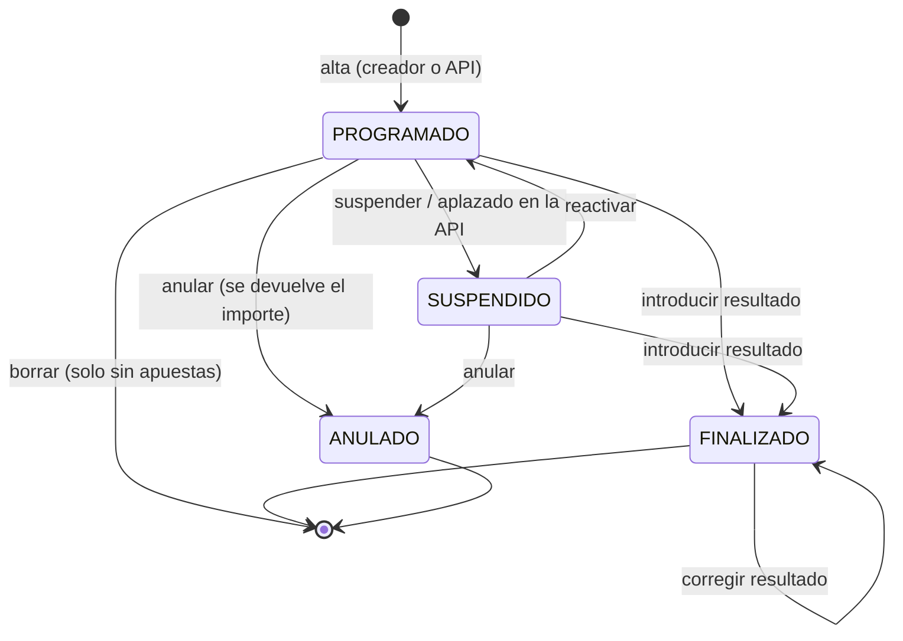
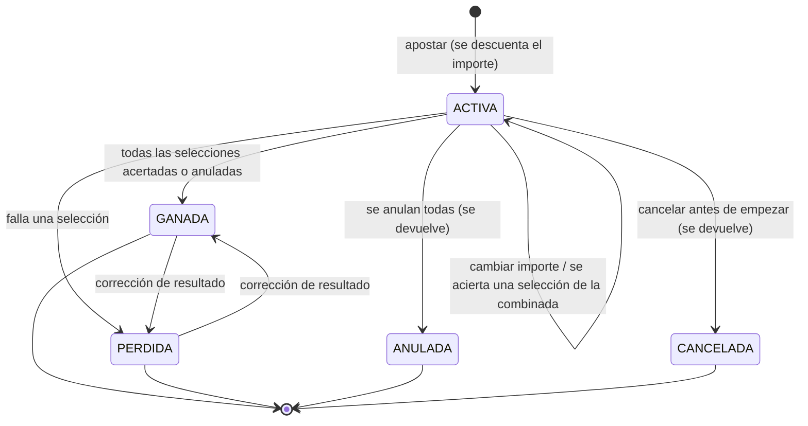
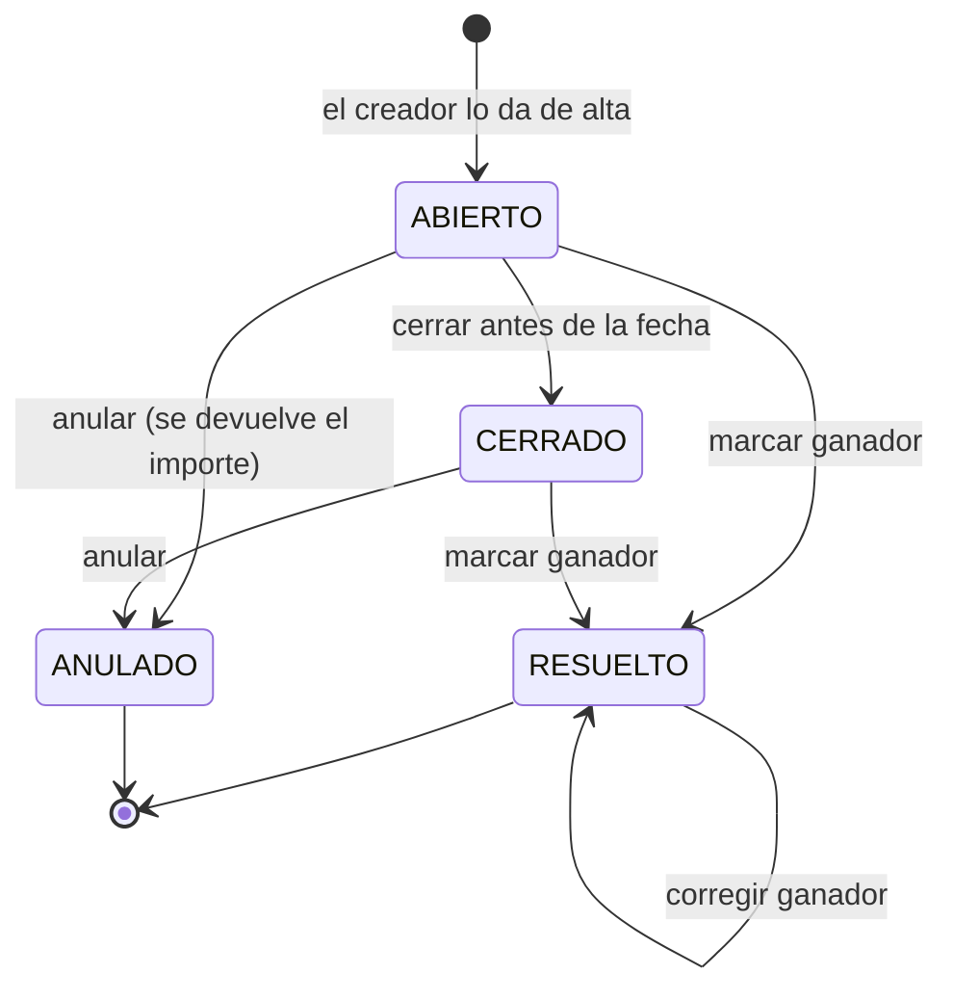
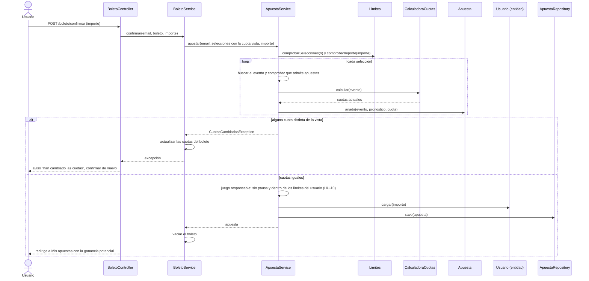
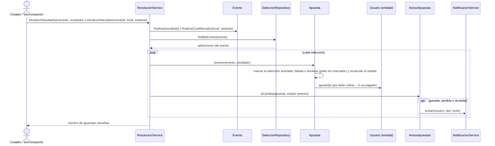
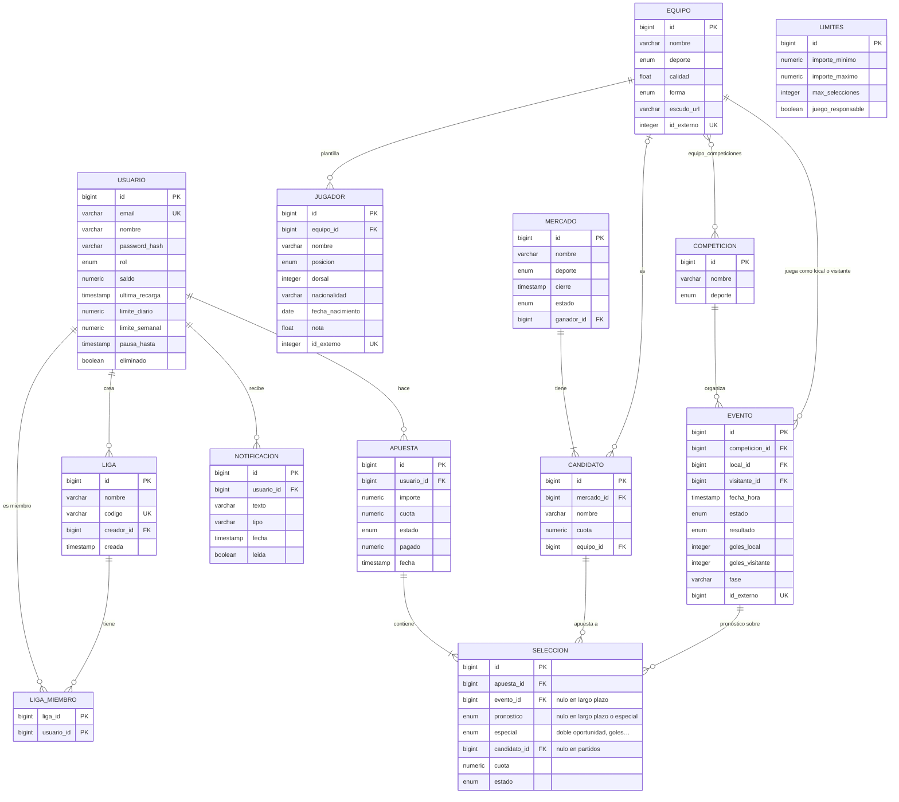

# Diseño: diagramas UML

Diagramas del sistema tal como está implementado al final del Sprint 11. Están escritos en [Mermaid](https://mermaid.js.org/), que GitHub dibuja directamente al abrir este archivo. Para editarlos se puede usar el editor de <https://mermaid.live>.

1. [Casos de uso](#1-casos-de-uso)
2. [Arquitectura por capas](#2-arquitectura-por-capas)
3. [Modelo del dominio (clases)](#3-modelo-del-dominio-clases)
4. [Estados de un evento, una apuesta y un mercado](#4-estados)
5. [Secuencia: apostar una combinada](#5-secuencia-apostar-una-combinada)
6. [Secuencia: resolver un partido](#6-secuencia-resolver-un-partido)
7. [Modelo de datos](#7-modelo-de-datos)

## 1. Casos de uso

Mermaid no tiene diagrama de casos de uso; se representa con actores a los lados y los casos de uso en el centro. Entre paréntesis, la historia de usuario.

El usuario hereda los casos del visitante, y el creador los del usuario salvo apostar y las ligas (el creador no aparece en el ranking).

## 2. Arquitectura por capas

Aplicación web monolítica con Spring Boot (MVC). Cada paquete agrupa una parte del dominio con sus controladores, servicios, entidades y repositorios.

| Paquete | Contenido |
|---|---|
| `usuarios` | Registro, inicio de sesión, cuenta, saldo y recargas |
| `equipos` | Competiciones, equipos, deportes y forma |
| `eventos` | Eventos, catálogo, ficha de equipo y cara a cara |
| `cuotas` | Algoritmo de cuotas (calidad, forma y volumen) y otros tipos de apuesta |
| `apuesta` | Apuestas, selecciones, boleto, resolución, límites, ranking, cuentas de la casa y avisos de apuestas |
| `ligas` | Ligas privadas con código de invitación |
| `mercados` | Mercados a largo plazo y sus candidatos |
| `notificaciones` | Avisos a los usuarios |
| `gestion` | Panel del creador de apuestas |
| `api` | Cliente de football-data.org y sincronización |
| `config`, `web` | Seguridad, datos iniciales, reloj y utilidades de las vistas |

## 3. Modelo del dominio (clases)

Atributos y operaciones principales; se omiten los getters y los constructores.

**Enumerados:** `Posicion` (PORTERO, DEFENSA, CENTROCAMPISTA, DELANTERO), `Deporte` (FUTBOL, BALONCESTO, TENIS, AUTOMOVILISMO, MOTOCICLISMO), `Forma` (MUY_MALA … MUY_BUENA), `Rol` (USUARIO, CREADOR), `Resultado` (LOCAL, EMPATE, VISITANTE), `Especial` (doble oportunidad, goles y ambos marcan), `EstadoEvento`, `EstadoApuesta`, `EstadoSeleccion` y `EstadoMercado`.

**Decisiones de diseño:**
- **Una apuesta simple es una combinada de una sola selección,** así hay una única forma de guardar, pagar y mostrar las apuestas.
- **Una selección apunta a un evento (con su pronóstico 1X2 o un tipo especial) o a un candidato de un mercado,** nunca a los dos. Por eso las apuestas a largo plazo y los nuevos tipos comparten historial, estadísticas y ranking con el resto.
- **Las apuestas de goles necesitan el marcador:** si solo se conoce el ganador, se anulan (cuota 1,00) en lugar de darse por falladas.
- **El ranking de una liga es el ranking general filtrado por sus miembros,** así los criterios y las cifras son siempre los mismos.
- **La cuota se guarda en cada selección al apostar:** los cambios posteriores (forma, dinero apostado, cuotas del creador) no afectan a las apuestas ya hechas.
- **`pagado` guarda lo que ya se ha abonado,** así una corrección de resultado paga o retira solo la diferencia.
- **Eliminar una cuenta la anonimiza en lugar de borrarla:** desaparecen el email, el nombre y los avisos, pero la fila se conserva para que las apuestas ya hechas sigan cuadrando.

## 4. Estados

### Evento

### Apuesta

Cada paso a GANADA, PERDIDA o ANULADA crea un aviso para el usuario (HU-37).

### Mercado a largo plazo

Un mercado abierto deja de admitir apuestas al llegar su fecha de cierre aunque siga en ABIERTO.

## 5. Secuencia: apostar una combinada

El usuario ya ha añadido varias cuotas del catálogo a su boleto y pulsa *Confirmar apuesta* (HU-28, HU-29).

## 6. Secuencia: resolver un partido

El resultado (o el marcador, en fútbol) lo introduce el creador en *Gestión* o llega de la API en la sincronización programada (HU-04, HU-25, HU-37, HU-52).

## 7. Modelo de datos

Tablas que crean las migraciones de `src/main/resources/db/migration`.

