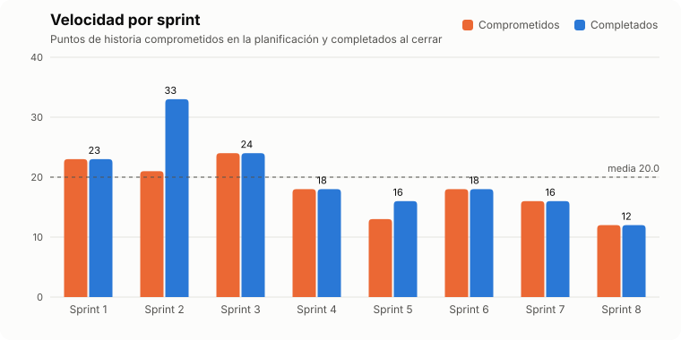
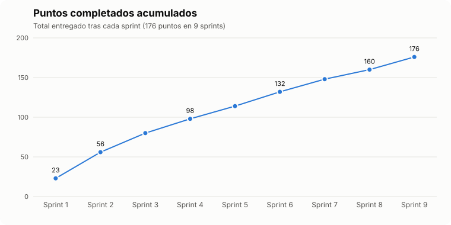

# Métricas del proyecto

Puntos de historia por sprint, sacados de las actas de `sprints/`. Las gráficas se generan con `python3 docs/scrum/graficas/generar.py`. Al cerrar un sprint, se añade su fila a la lista `SPRINTS` de ese script y se vuelve a ejecutar.

## Velocidad

| Sprint | Comprometidos | Completados | Nota |
|---:|---:|---:|---|
| 1 | 23 | 23 | |
| 2 | 21 | 33 | 12 puntos añadidos durante el sprint (búsqueda, cancelar, ranking por saldo, más deportes, escudos) |
| 3 | 24 | 24 | |
| 4 | 18 | 18 | |
| 5 | 13 | 16 | 3 puntos añadidos: migraciones con Flyway por el error 500 del ranking |
| 6 | 18 | 18 | |
| 7 | 16 | 16 | |
| 8 | 12 | 12 | |
| 9 | 12 | 16 | 4 puntos añadidos: interruptor del juego responsable en Gestión y rediseño visual |
| **Total** | **157** | **176** | Media de 19,6 puntos por sprint |

- **Comprometidos:** puntos de las historias elegidas en la Sprint Planning.
- **Completados:** todo lo terminado al cerrar el sprint, incluido el trabajo que el PO añadió durante el sprint. HU-36 (3 puntos), que en el Sprint 2 quedó a medias (ranking solo por saldo), está contada en ese sprint.
- **Lectura:** se ha completado todo lo comprometido en cada sprint. La velocidad baja a partir del Sprint 4 porque las historias del MVP más grandes (cuotas, resolución, combinadas) ya estaban hechas. La media de unos 20 puntos sirve para planificar los siguientes sprints.

## Progreso acumulado (burnup)

| Tras el sprint | 1 | 2 | 3 | 4 | 5 | 6 | 7 | 8 | 9 |
|---|---:|---:|---:|---:|---:|---:|---:|---:|---:|
| Puntos acumulados | 23 | 56 | 80 | 98 | 114 | 132 | 148 | 160 | 176 |

- El **MVP** quedó completo en el Sprint 4, con 98 puntos.
- Del Sprint 5 en adelante se han hecho historias *Should* y *Could*: la API, las apuestas a largo plazo, las estadísticas de equipos, los avisos, la gestión de la cuenta y el juego responsable.

## ¿Y el burndown de cada sprint?

Un burndown diario necesita anotar, cada día del sprint, los puntos que quedan por hacer. Los sprints de este proyecto se han desarrollado de forma concentrada, en una o dos sesiones, así que su burndown diario sería una sola bajada de la línea y no aportaría información. Por eso se muestran la velocidad y el burnup del proyecto, que sí reflejan cómo avanza.

Para los próximos sprints, el burndown se puede llevar con una tabla en el acta del sprint, rellenada en cada daily:

| Día | Puntos pendientes | Ideal |
|---|---:|---:|
| 1 | 12 | 12 |
| 2 | … | 11 |
| … | … | … |
